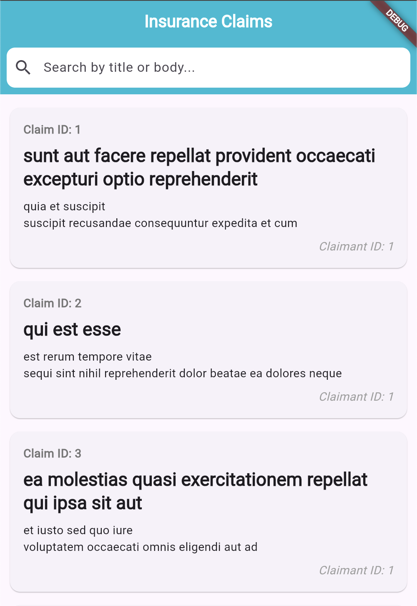
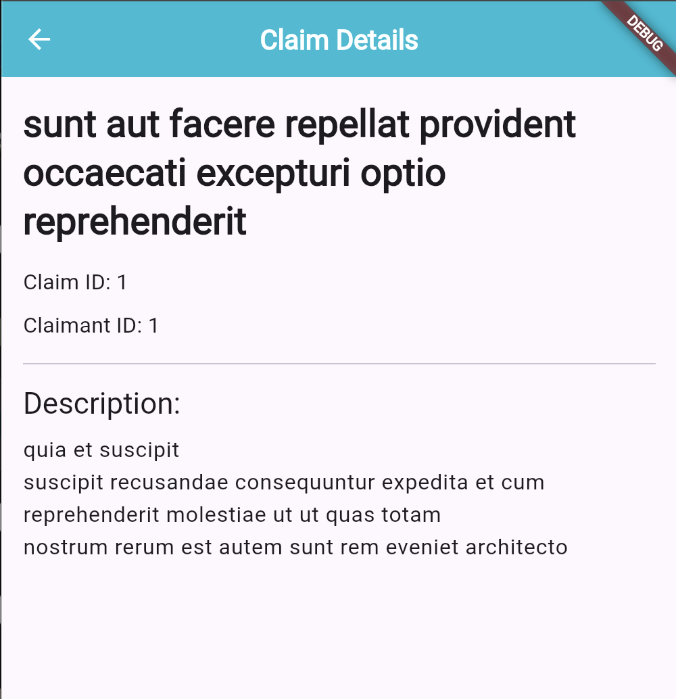
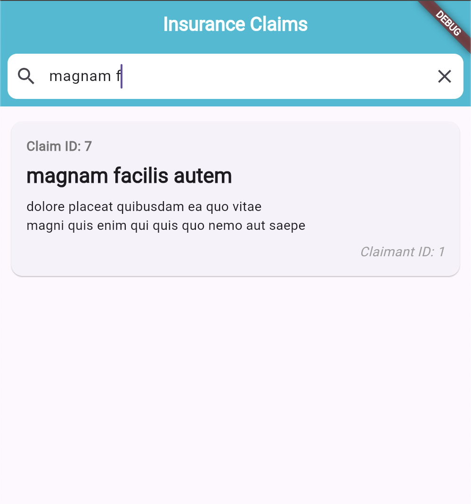

# Flutter Claims App

This is a sample Flutter application for managing insurance claims. The app demonstrates the use of the BLoC state management pattern to fetch, filter, and display a list of claims from a remote API. It includes a search feature and a detailed view for each claim.

## Features

* Fetches a list of claims from a public API.

* Displays a list of claims with a title and a brief description.

* A search bar to filter claims by title or body.

* A detail page to view the full information of a claim.

* Error handling with `SnackBar` to notify the user of any issues.


## Prerequisites

Before you begin, ensure you have the following installed:

* **Flutter SDK**: [Installation Guide](https://docs.flutter.dev/get-started/install)

* **A text editor or IDE**: We recommend [Visual Studio Code](https://code.visualstudio.com/) or [Android Studio](https://developer.android.com/studio).


## Getting Started

1. **Clone the repository** (if applicable) or copy the project files to your local machine.

2. **Install dependencies**:
   Navigate to the project directory in your terminal and run:

```dart
flutter pub get

```

This command fetches all the packages and dev dependencies required for the project, including `bloc_test` and `mockito` for testing.

## Running the Application

To run the app on a connected device or emulator, execute the following command:
```dart
flutter pub run

```

## Running the Tests

The project includes a comprehensive set of unit and widget tests to ensure the reliability of the application logic and UI components.

To run all tests, simply use the following command from the project root:
```dart
flutter test

```

### Breakdown of Test Files

* **`test/models/claim_model_test.dart`**: Contains unit tests for the `Claim` model, verifying that it correctly parses JSON data.

* **`test/claims/bloc/claims_bloc_test.dart`**: Contains unit tests for the `ClaimsBloc`, ensuring that state transitions and business logic (like fetching and searching) work as expected.

* **`test/claims_widget_test.dart`**: Contains widget tests for UI components like `ClaimCard`, ensuring that the widgets render correctly with the provided data.

